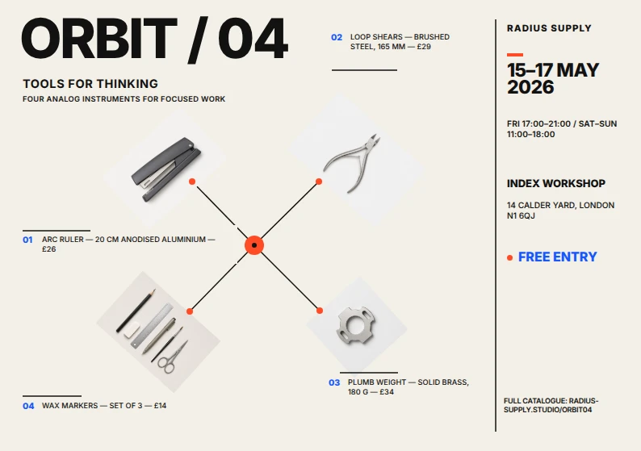
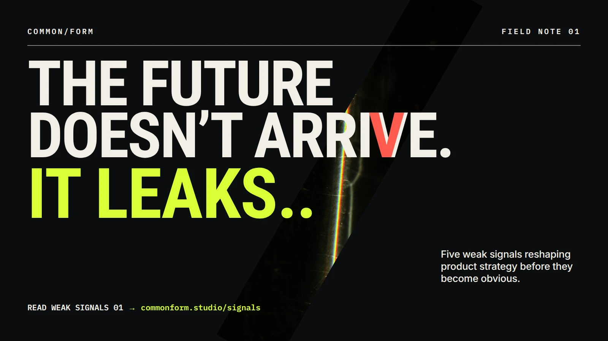
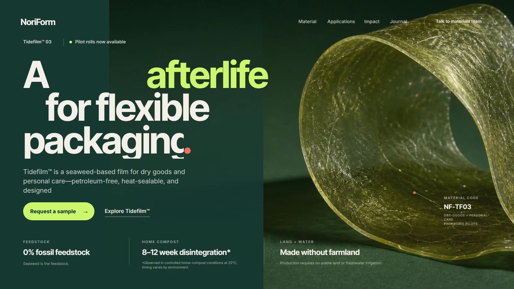
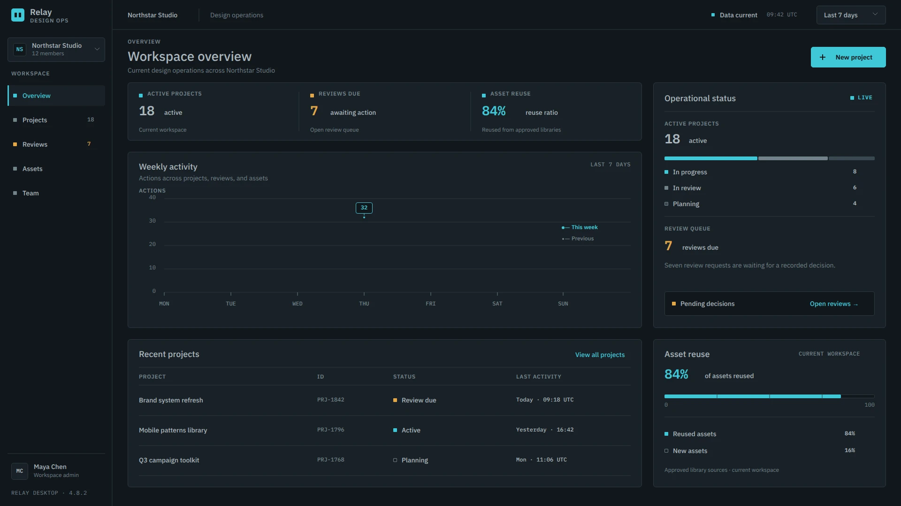
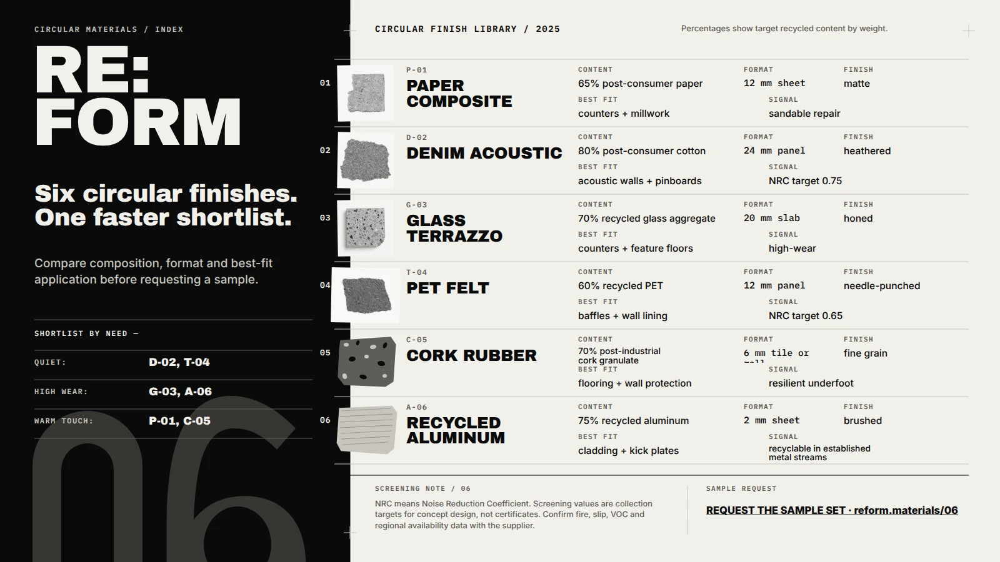
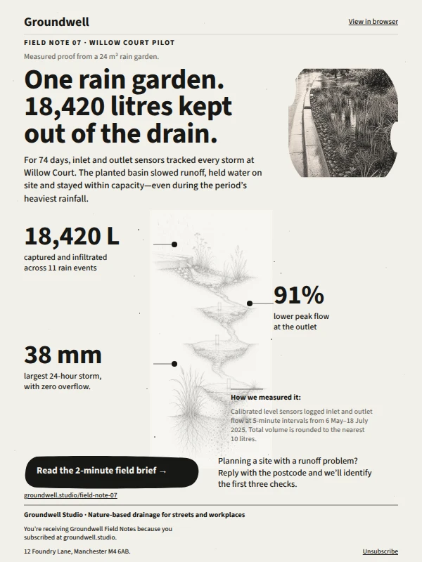

<p align="center">
  
</p>

<h1 align="center">StarryKit Plugin</h1>

<p align="center">
  Turn an idea into a polished, editable presentation or visual design—without leaving your AI agent.
</p>

<p align="center">
  <a href="README.zh-CN.md">简体中文</a> ·
  <a href="#install">Install</a> ·
  <a href="#see-it-in-action">Demos</a> ·
  <a href="#usage">Usage</a> ·
  <a href="#features">Features</a> ·
  <a href="docs/README.md">Manual setup</a> ·
  <a href="https://starrykit.com">Website</a>
</p>

StarryKit turns your AI agent into a visual co-creator:

- ✨ Go from a prompt to a polished presentation, poster, or social graphic.
- 🎨 Keep every page fully editable and review each draft in StarryKit.
- 🔌 Use one shared Skill and Hosted MCP across Codex, Claude Code, Cursor, OpenCode, OpenClaw, and more.

## Install

Send this to your agent:

```text
Set up StarryKit for this agent.
Skill: npx skills add StarryKit/starrykit-plugin --skill starrykit-authoring -g -y
MCP: https://mcp.starrykit.com/mcp
```

Your agent installs the Skill, configures the MCP, and opens browser OAuth. If needed, open the [manual setup guides](docs/README.md).

## See it in action

### Create and Refine with AI


### Edit Manually and Export


## Usage

Each request produces an editable StarryKit result you can review and continue refining.

### Prompt

#### Presentation

| Prompt | Showcase |
| --- | --- |
| **Product catalog**<br><br>“Create a six-page launch catalog for a modular acoustic collection. Make it editorial, tactile, and specification-ready.” |  |
| **Technical launch**<br><br>“Turn this incident-response brief into a high-contrast launch deck built around one clear proof point: verified cause in 11 minutes.” |  |
| **Strategy proposal**<br><br>“Build an executive strategy deck for a 90-day shade pilot. Keep it warm, editorial, and grounded in one clear public-space outcome.” |  |

#### Poster

| Prompt | Showcase |
| --- | --- |
| **Open studios**<br><br>“Create a stark monochrome poster for an open-studios night. Make unfinished work feel intentional, physical, and inviting.” |  |
| **AI summit**<br><br>“Design a futuristic event poster for a human-centered AI summit, pairing precise typography with an atmospheric signal visualization.” |  |
| **Product showcase**<br><br>“Turn this four-product brief into a clean catalog poster for a weekend tools showcase, with price and event details easy to scan.” |  |

#### Social Media

| Prompt | Showcase |
| --- | --- |
| **Product drop**<br><br>“Create a bold social launch graphic for a modular desk-accessory collection, using numbered callouts and electric color.” |  |
| **Educational carousel**<br><br>“Design a clean social carousel that teaches six typography styles every designer should know.” |  |
| **Thought leadership**<br><br>“Create a high-impact social graphic for a report on five weak signals reshaping product strategy.” |  |

### More from the Gallery

| Web | UI | Diagram |
| :---: | :---: | :---: |
|  |  |  |
| **Web** | **UI** | **Card** |
|  |  |  |
| **Infographic** | **Email** | **Email** |
|  |  |  |

You can also ask StarryKit to inspect an existing document, tighten its story, redesign one page, reorder content, or export selected pages.

## Features

| Feature | What it means |
| --- | --- |
| ✏️&nbsp;Editable | Every design stays editable in StarryKit—from individual elements to complete pages. |
| 📤&nbsp;Perfect&nbsp;export | Export complete documents or selected pages cleanly to PPTX, PDF, SVG, PNG, JPEG, HTML, or Google Slides. |
| 💡&nbsp;1000+&nbsp;Prompts | Explore [1,000+ ready-to-use prompts](https://starrykit.com/explore) and visual ideas, then open one in StarryKit to make it your own. |

---

<sub>Historical note: this repository previously hosted Starry Slides. Its final source snapshot remains available on the <a href="https://github.com/StarryKit/starrykit-plugin/tree/archive/starry-slides-v0.1.38">archive/starry-slides-v0.1.38</a> branch.</sub>
