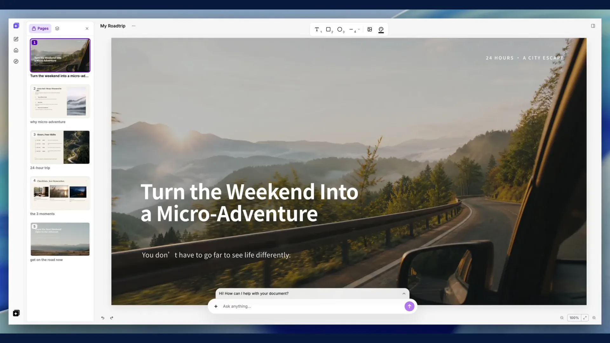
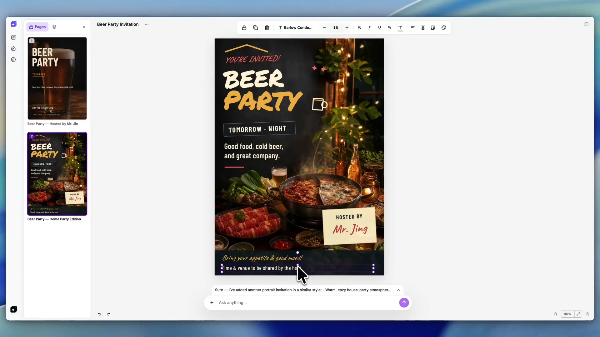

<p align="center">
  
</p>

<h1 align="center">StarryKit Plugin</h1>

<p align="center">
  不离开你的 AI Agent，把一个想法变成精致、可继续编辑的演示文稿与视觉设计。
</p>

<p align="center">
  <a href="README.md">English</a> ·
  <a href="#安装">安装</a> ·
  <a href="#看看实际效果">效果展示</a> ·
  <a href="#使用方法">使用方法</a> ·
  <a href="#关键指标">关键指标</a> ·
  <a href="#功能">功能</a> ·
  <a href="#手动安装">手动安装</a> ·
  <a href="https://starrykit.com">官方网站</a>
</p>

StarryKit 让你的 AI Agent 直接拥有视觉创作能力：

- ✨ 从一句 Prompt 开始，完成演示文稿、海报或社交媒体图片。
- 🎨 所有页面保持完整可编辑，每一份草稿都可以在 StarryKit 中审核。
- 🔌 一套 Skill 与 Hosted MCP，同时支持 Codex、Claude Code、Cursor、OpenCode、OpenClaw 等宿主。

## 安装

把这一段发送给你的 Agent：

```text
请为当前 Agent 配置 StarryKit。
Skill: npx skills add StarryKit/starrykit-plugin --skill starrykit-authoring -g -y
MCP: https://mcp.starrykit.com/mcp
```

Agent 会安装 Skill、配置 MCP 并打开浏览器 OAuth。需要手动操作时，请在[手动安装](#手动安装)中选择对应宿主。

## 看看实际效果

### 创建并持续优化一份完整演示文稿


<p align="center"><a href="assets/demos/roadtrip-editing.mp4">观看高清演示文稿 Demo</a></p>

### 创建一张可编辑的活动视觉


<p align="center"><a href="assets/demos/event-design.mp4">观看高清活动视觉 Demo</a></p>

## 使用方法

每一个请求都会得到一份可在 StarryKit 中审核、编辑和继续优化的结果。

| Prompt | Showcase |
| --- | --- |
| **演示文稿**<br><br>“帮我做一份五页的公路旅行 Deck。整体乐观、有编辑感、以图片为主，每一页只表达一个核心观点。” |  |
| **海报**<br><br>“把这份活动 Brief 做成一张大胆、可编辑的社交媒体竖版海报，然后导出 PNG。” |  |

你也可以让 StarryKit 检查已有文档、收紧叙事、重新设计某一页、调整页面顺序，或者只导出指定页面。

## 关键指标

| ⚡ 一句 Prompt 安装 | 🧰 14 个 MCP 工具 | 📤 7 种导出格式 | 🔐 浏览器 OAuth |
| --- | --- | --- | --- |
| 同时配置 Skill 与 MCP | 读取、创作、预览与导出 | PPTX、PDF、SVG、PNG、JPEG、HTML、Google Slides | 无需粘贴 access token |

## 功能

| 功能 | Agent 可以做什么 |
| --- | --- |
| ✨ 视觉创作 | 创建演示文稿、海报、社交媒体图片、邀请函和其他可编辑设计。 |
| 🔎 文档发现 | 只浏览你已经授权的 StarryKit 文档与文件夹。 |
| 🎨 设计指导 | 建立清晰的信息层级、有意图的构图和针对每一页的视觉方向。 |
| 🛠 精确修改 | 读取内容与预览，然后编辑、重写、改标题或移动正确的页面。 |
| ✅ 草稿审核 | 每一张生成页面都交回 StarryKit，由你审核并决定是否采用。 |
| 📤 灵活导出 | 将完整文档或指定页面导出为七种支持格式。 |

## 手动安装

如果 Agent 无法自动完成安装，请查看对应宿主的中英文指南：

| 宿主 | 中文 | English |
| --- | --- | --- |
| Codex | [安装](docs/codex/README.zh-CN.md) | [Setup](docs/codex/README.md) |
| Claude Code | [安装](docs/claude-code/README.zh-CN.md) | [Setup](docs/claude-code/README.md) |
| Cursor | [安装](docs/cursor/README.zh-CN.md) | [Setup](docs/cursor/README.md) |
| OpenCode | [安装](docs/opencode/README.zh-CN.md) | [Setup](docs/opencode/README.md) |
| OpenClaw | [安装](docs/openclaw/README.zh-CN.md) | [Setup](docs/openclaw/README.md) |
| Pi | [当前限制](docs/pi/README.zh-CN.md) | [Current limitation](docs/pi/README.md) |
| 其他 MCP 宿主 | [安装](docs/other-hosts/README.zh-CN.md) | [Setup](docs/other-hosts/README.md) |

仓库维护者可以阅读 [development.md](docs/development.md)，了解 CI workflow 与测试实际覆盖和不覆盖的内容。

<sub>历史说明：这个仓库过去用于 Starry Slides。最终源码快照仍保存在 <a href="https://github.com/StarryKit/starrykit-plugin/tree/archive/starry-slides-v0.1.38">archive/starry-slides-v0.1.38</a> 分支。</sub>
