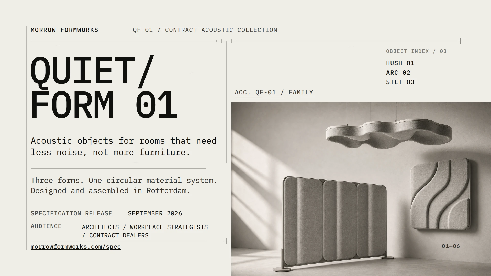
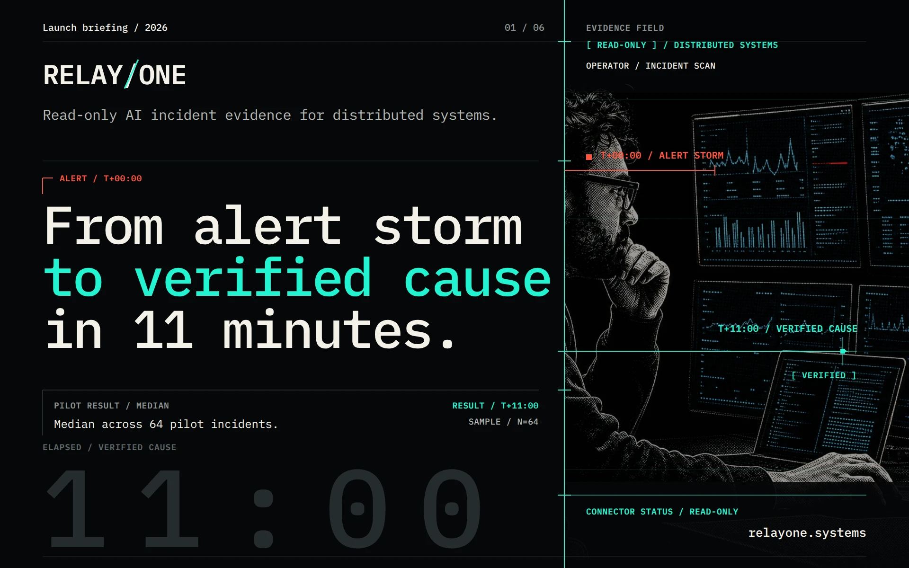
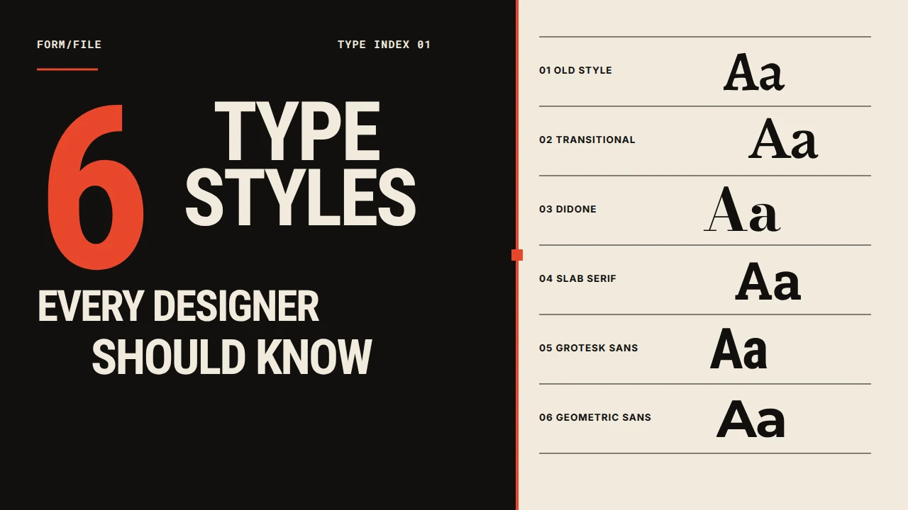
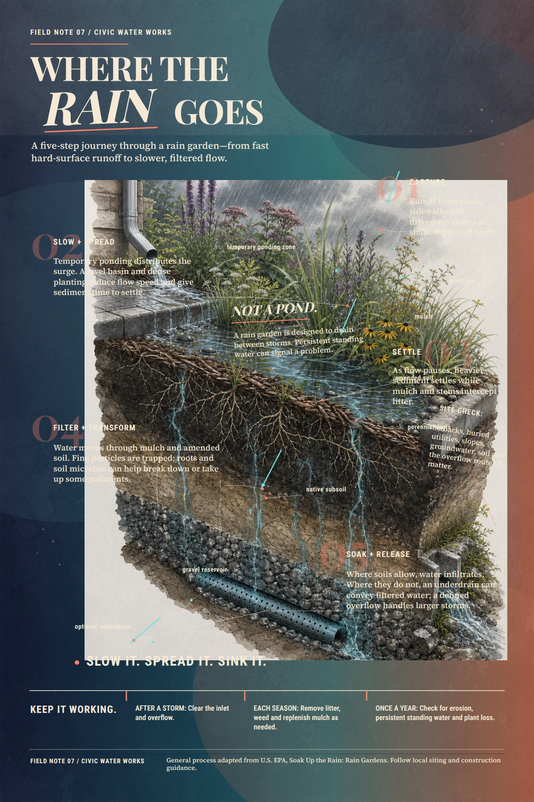

<p align="center">
  
</p>

<h1 align="center">StarryKit Plugin</h1>

<p align="center">
  不离开你的 AI Agent，把一个想法变成精致、可继续编辑的演示文稿与视觉设计。
</p>

<p align="center">
  <a href="README.md">English</a> ·
  <a href="#安装">安装</a> ·
  <a href="#看看实际效果">效果展示</a> ·
  <a href="#使用方法">使用方法</a> ·
  <a href="#功能">功能</a> ·
  <a href="docs/README.zh-CN.md">手动安装</a> ·
  <a href="https://starrykit.com">官方网站</a>
</p>

StarryKit 让你的 AI Agent 直接拥有视觉创作能力：

- ✨ 从一句 Prompt 开始，完成演示文稿、海报或社交媒体图片。
- 🎨 所有页面保持完整可编辑，每一份草稿都可以在 StarryKit 中审核。
- 🔌 一套 Skill 与 Hosted MCP，同时支持 Codex、Claude Code、Cursor、OpenCode、OpenClaw 等宿主。

## 安装

把这一段发送给你的 Agent：

```text
请为当前 Agent 配置 StarryKit。
Skill: npx skills add StarryKit/starrykit-plugin --skill starrykit-authoring -g -y
MCP: https://mcp.starrykit.com/mcp
```

Agent 会安装 Skill、配置 MCP 并打开浏览器 OAuth。需要手动操作时，请打开[宿主安装指南](docs/README.zh-CN.md)。

## 看看实际效果

### 用 AI 创建和优化


### 手动编辑和导出


## 使用方法

每一个请求都会得到一份可在 StarryKit 中审核、编辑和继续优化的结果。

### Prompt → Showcase

| Prompt | Showcase |
| --- | --- |
| **产品目录**<br><br>“为一组模块化吸音产品制作一份六页发布目录，要有编辑感、材质感，并且能够清楚呈现产品规格。” |  |
| **技术发布**<br><br>“把这份事故响应 Brief 做成一份高对比度发布 Deck，围绕一个核心证据展开：11 分钟内定位根因。” |  |

### 更多 Gallery 作品

| | |
| --- | --- |
|  |  |
|  |  |

你也可以让 StarryKit 检查已有文档、收紧叙事、重新设计某一页、调整页面顺序，或者只导出指定页面。

## 功能

| 功能 | 说明 |
| --- | --- |
| ✏️&nbsp;完整可编辑 | 所有 Design 都能在 StarryKit 中继续编辑，包括单个元素和完整页面。 |
| 📤&nbsp;完美导出 | 完整文档或指定页面都可以顺畅导出为 PPTX、PDF、SVG、PNG、JPEG、HTML 或 Google Slides。 |
| 💡&nbsp;1000+&nbsp;Prompts | 浏览 [1,000+ 个可以直接使用的 Prompt](https://starrykit.com/explore) 与视觉灵感，并在 StarryKit 中打开、编辑成自己的作品。 |

---

<sub>历史说明：这个仓库过去用于 Starry Slides。最终源码快照仍保存在 <a href="https://github.com/StarryKit/starrykit-plugin/tree/archive/starry-slides-v0.1.38">archive/starry-slides-v0.1.38</a> 分支。</sub>
